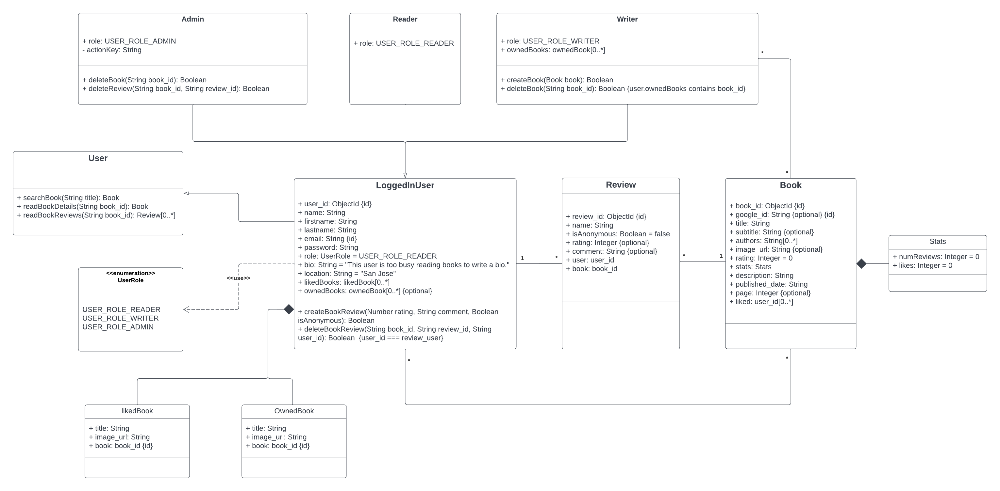

# Rotten Apples 
--------Book review web app--------

**How to run the program:**  
Client: `npm start`  
Server: `npm start`  
 
**Functions:** 
Register, login,  
home page: display most popular and recent reviewed books 
book details page: where log-in users can write reviews and click likes, 
profile page, edit profile page, 
search books from Google APT and store book in local database

**Three user roles:** 
Reader: browse book and write book reviews 
Writer: add books to local database 
Admin: delete book reviews 

**UML Diagram**

